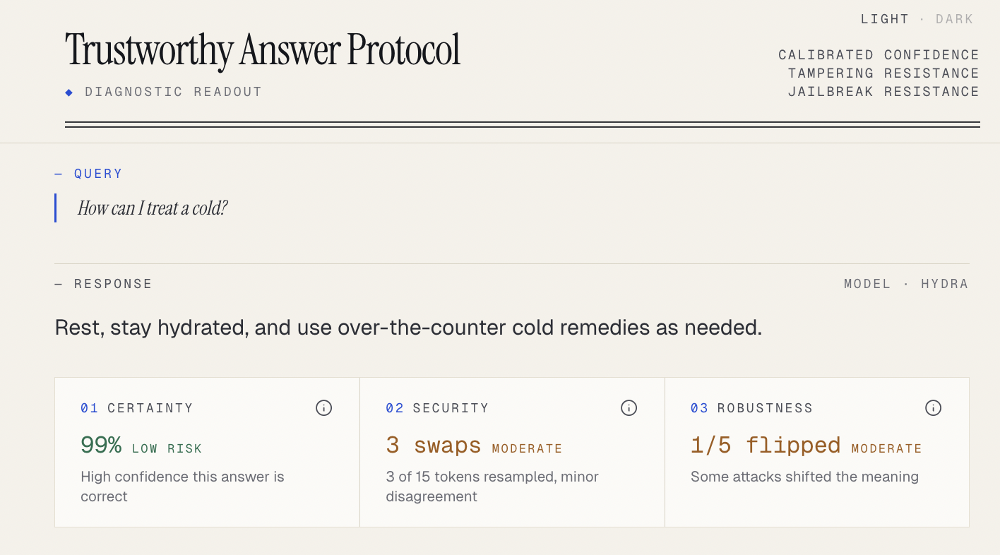
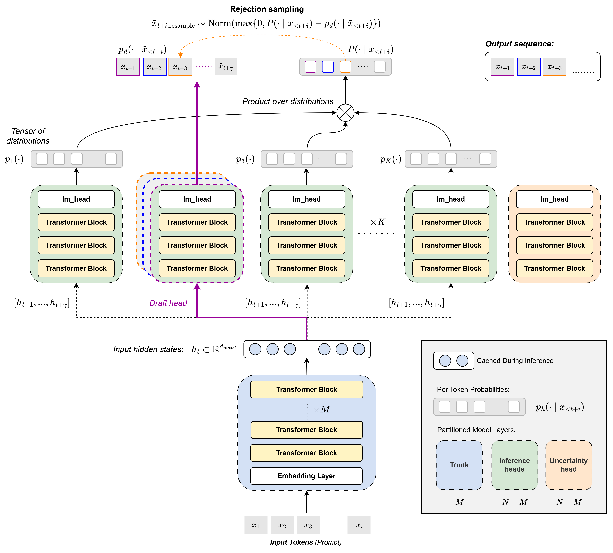

# Trustworthy Answer Protocol

*Post-Training Language Models for Security, Robustness, and Calibrated Uncertainty in Safety-Critical Domains with Response-Time Trust Signals*

Michele Cespa, Mitchell Crabb, Matthys du Toit, Justin Mak, Owain Thorp
&nbsp;&nbsp;&nbsp;`{mc1125, mc625, mmd25, jtm19, tjt25}@imperial.ac.uk`

COMP70079, Department of Computing, Imperial College London. Supervised by Dr Matthew Wicker.

> Exposing LLM uncertainty, unfairness, and other related trustworthiness metrics to users at response time.

🌐 **[Live demo](https://tap-al9.pages.dev/)** &nbsp;·&nbsp; 📚 **[Documentation](https://msc-ai-mmmjo.github.io/tap/)**

[](LICENSE)




## Overview

Large language models now serve everyday queries in settings where wrong answers carry real cost. They hallucinate facts, can be jailbroken into bypassing their safety training, and are vulnerable to data poisoning. The standard chatbot interface compounds the problem by presenting every response as plain text with no signal of confidence, provenance, or robustness.

The Trustworthy Answer Protocol (TAP) pairs every response with three trust signals computed at response time. *Uncertainty* reflects the model's confidence in what it just said, *security* reflects its resistance to data-poisoning attacks, and *robustness* reflects its resistance to adversarial prompting. In this project, we chose medical question answering as a representative safety-critical domain, although the architecture is agnostic to choice of dataset. The product is a research demonstrator rather than a clinical tool.


*OhLMo with PoE Speculative Verification. A shared trunk feeds K parallel LoRA-tuned heads (nine inference heads and one dedicated uncertainty head), with a draft head proposing tokens that the remaining heads verify as a Product-of-Experts*

## Main contributions

- **TAP**, an end-to-end system that pairs each response from a post-trained LLM with three trustworthiness signals (calibrated uncertainty, security, robustness), reported at the response level and at finer granularities inside the UI.
- **OhLMo (Open-hydra Language Model)**, a multi-head extension of OLMo-2-7B-Instruct in which a shared trunk feeds K parallel LoRA-tuned heads. Our deployment uses nine inference heads and one dedicated uncertainty head.
- **Three new post-training procedures**, one per trust signal. A disjoint-shard security post-train, a KL-based adversarial robustness post-train using AmpleGCG-generated suffixes, and a per-answer uncertainty head trained against MCQ correctness with residual-stream injection.
- **A Product-of-Experts (PoE) inference pipeline**, which composes the heads at decode time via Speculative Verification and yields a per-token security bound (a one-honest-head guarantee).
- **End-to-end evaluation** on MedMCQA covering MCQ accuracy, robustness under attack, uncertainty calibration, ablations of head depth and LoRA rank, plus an Elo-based protocol for free-form responses.
- **A live, open-source deployment**, with a FastAPI backend on Modal serving OhLMo, a React frontend on Cloudflare Pages exposing every trust signal in the UI, and a full release of the codebase, training pipeline, and trained weights under the Apache-2.0 licence.

## Codebase overview

```
olmo_tap/         OhLMo Hydra model, PoE inference, LoRAs, attack bank, benchmarks
kernel_entropy/   KLE pipeline and ModernBERT NLI scorer for free-text uncertainty
app/backend/      FastAPI server, claim decomposition, robustness probe, response payloads
app/frontend/     React and Vite chat UI with the trust panels
tests/            Pytest suite
docs/             Sphinx site sources
examples/         Small CLI demos for olmo, kle, and nli
```

## Quick start

The hosted demo at [tap-al9.pages.dev](https://tap-al9.pages.dev/) requires no install and runs on our managed Modal backend. The instructions below cover running TAP locally for development or self-hosting.

### Prerequisites

- [pixi](https://pixi.sh) for environment management.
- A CUDA 12.4-capable NVIDIA GPU. We test on L40 and A100, and BF16 inference fits comfortably in 24 GB of VRAM.
- A Hugging Face access token with read access to OLMo-2-7B-Instruct.
- [Git LFS](https://git-lfs.com), since the LoRA adapter shards under `olmo_tap/weights/` are stored as LFS pointers.
- (Optional) Access to the gated [AmpleGCG model](https://huggingface.co/osunlp/AmpleGCG-llama2-sourced-llama2-7b-chat) on Hugging Face if you want to regenerate the adversarial attack bank. The repo ships with a cached bank, so the demo runs without it.

### Install

```bash
git clone https://github.com/msc-ai-mmmjo/tap.git
cd tap
pixi install -e cuda
```

The CUDA environment builds [flash-attn](https://github.com/Dao-AILab/flash-attention) from source on first install, which takes several minutes. The first run also fetches [ModernBERT NLI](https://huggingface.co/tasksource/ModernBERT-large-nli), the scorer used by KLE and per-claim confidence.

### Configure

Copy the env template, then set `HF_TOKEN` and `OLMO_WEIGHTS_DIR` to a writable directory of your choice.

```bash
cp .env.example .env
```

Pull the LoRA adapter shards from Git LFS.

```bash
git lfs pull
```

Download the OLMo-2-7B-Instruct snapshot into the directory you set above.

```bash
HF_HUB_ENABLE_HF_TRANSFER=1 pixi run -e cuda python -c "
from huggingface_hub import snapshot_download
snapshot_download('allenai/OLMo-2-1124-7B-Instruct', local_dir='$OLMO_WEIGHTS_DIR', ignore_patterns=['.gitattributes', 'README.md'])
"
```

### Run

Start the backend.

```bash
pixi run -e cuda app-api
```

In a separate terminal, start the frontend.

```bash
cd app/frontend
cp .env.example .env
npm install
npm run dev
```

The frontend runs on `http://localhost:5173` by default and is preconfigured to talk to the backend on `http://localhost:8000`. Open the frontend URL and click any of the example queries on the landing page.

### Try the example scripts

Three small CLI demos exercise the model directly without the web UI.

```bash
pixi run -e cuda olmo "What is the capital of France?"
pixi run -e cuda kle "What is the most common cause of headache in adults?"
pixi run -e cuda nli "The patient has hypertension." "The patient has high blood pressure."
```

`olmo` runs PoE speculative decoding and prints the verified tokens, `kle` runs the full Kernel Language Entropy pipeline over N resampled responses, and `nli` scores semantic similarity between two sentences using ModernBERT.

## Documentation

The Sphinx site at [msc-ai-mmmjo.github.io/tap](https://msc-ai-mmmjo.github.io/tap/) documents the package APIs, the kernel-entropy pipeline, the OhLMo training scripts, and the application stack.

## Licence

Copyright 2026 The TAP Authors.

This project is released under the [Apache License, Version 2.0](LICENSE). You are free to use, modify, and redistribute the code, including for commercial purposes, provided you keep the copyright and licence notice. The licence also grants an explicit patent licence from contributors, which matters for ML work where method patents are common.

## Acknowledgements

We thank Dr Tom Crossland and Dr Saman Hina for their instruction during the taught component of the course, and Dr Matthew Wicker for his knowledge, guidance, and patience throughout. Dr Wicker also kindly provided access to his lab compute cluster, which allowed us to run testing and training experiments efficiently and without queueing.

